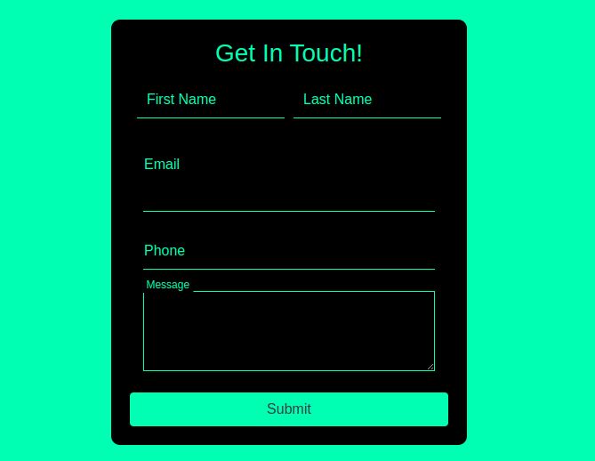

# HloMail Contact Form

This is a responsive contact form built with HTML, CSS, and Bootstrap 4. It features a modern design with floating labels and a dark color scheme.

## Features

- Responsive layout for desktop and mobile devices
- Floating labels for input fields
- Form validation for required fields
- Bootstrap 4 styling

## Technologies Used

- HTML5
- CSS3
- Bootstrap 4.5.2

## Form Structure

1. **Header**: A centered heading with the text "Get In Touch!".
2. **Contact Form**:
   - First Name input field
   - Last Name input field
   - Email input field
   - Phone input field
   - Message textarea
   - Submit button

## Styles

The form styles are defined in the `<style>` section of the HTML file. Here's a breakdown of the key styles:

- `.form-group`: Styles for the form group container.
- `.form-control`: Styles for the input fields, including removing the border, setting a transparent background, and customizing the color.
- `.form-control:focus`: Styles for the input fields when focused, including a border and removing the outline and box-shadow.
- `.form-control::placeholder`: Styles for the placeholder text, making it transparent.
- `.floating-label`: Styles for the floating labels, including positioning, color, and background.
- `.form-control:focus + .floating-label, .form-control:not(:placeholder-shown) + .floating-label`: Styles for the floating labels when the input field is focused or has a value, including transforming the label's position and font size.

## Footer

The form includes a fixed footer at the bottom of the page with the text "Created by HloMail". The footer is styled with a black background color and the same green color used throughout the form.

## Responsive Design

The form is designed to be responsive and adjust its layout based on the screen size. This is achieved using Bootstrap's grid system and media queries. On smaller screens (max-width: 767px), the card containing the form will have a width of 90% to ensure it fits properly.

## Usage

1. Clone the repository or copy the HTML code.
2. Open the `index.html` file in a web browser.
3. Fill out the form fields and submit the form (note: form submission logic is not included in this example).

## Customization

To customize the form, you can modify the styles in the `<style>` section of the HTML file or override them with your own CSS file. Additionally, you can adjust the Bootstrap classes used in the HTML markup to change the layout and styling of the form elements.

## Credits

This contact form was created by [HloMail](https://nexrof.in).
